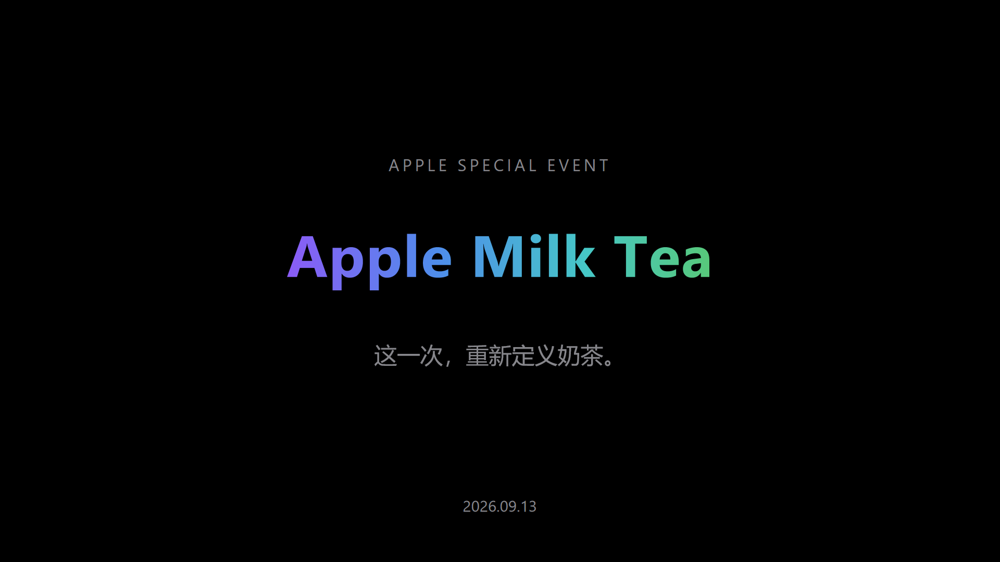
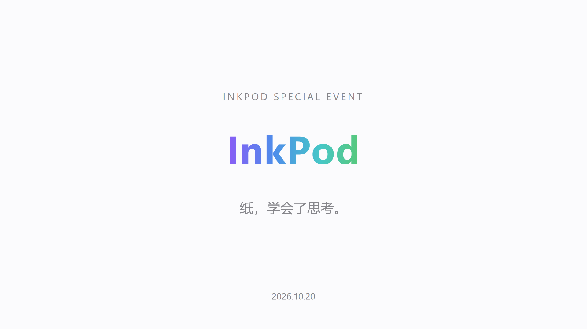
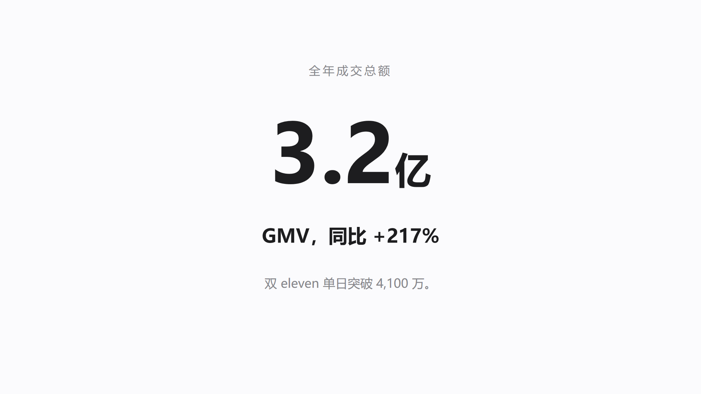
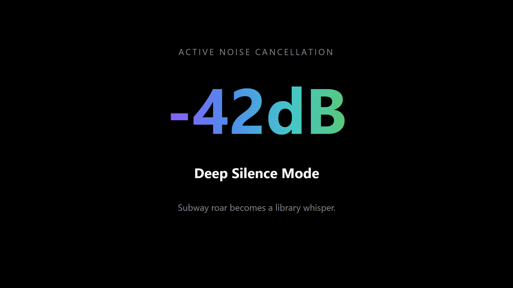

# apple-keynote-ppt

> 苹果发布会风格的 PPT 生成 Skill——把任意主题变成极简、大字、大留白的 Keynote 风演示文稿。

**公开仓库 · 仅供学习交流** | v1.1.0 | 标准 [Agent Skills](https://zhuanlan.zhihu.com/p/2026969192268579241) 格式，兼容 WorkBuddy / ZCode / Claude Code 等 Agent 宿主

---

## 概述

`apple-keynote-ppt` 是一个 AI Agent 技能（Skill）。安装后，对 AI 助手说一句"用苹果发布会风格做一个 XX 的 PPT"，它就会按规范化的六步工作流，产出一套与苹果 Keynote 发布会同等视觉水准的 `.pptx`：

- **纯黑舞台 / 纯白官网**双模式，配合苹果标志性四色渐变标题（紫→蓝→青→绿，XML 级真实渐变）
- **内容与样式分离**：AI 只产出 `outline.json` 大纲，渲染由脚本确定性完成——改文案零成本，风格 100% 一致
- **12 种坐标级版式** + 双道质检（代码级布局检查 + 渲染图视觉验收），杜绝溢出、重叠、乱码

姊妹项目：[ai-apple-video](https://github.com/huangbai-AI/ai-apple-video)（苹果风产品视频），两者共享同一套视觉语言。

## 核心特性

| 特性 | 说明 |
|---|---|
| 双模式色板 | 深色发布会（纯黑 `#000000`）与浅色官网（`#FBFBFD`）两种视觉世界 |
| 四色渐变标题 | `#8B5CF6→#4F8DEB→#46C7C7→#58C878`，通过 OOXML 后处理实现真实渐变文字 |
| 14 种版式 | 封面 / 宣言 / 章节 / 大数字 / 产品主图 / 图文分屏 / 功能点 / 对比 / 条形图 / 时间线 / 阵列 / 引言 / 定价 / 结尾 |
| 确定性渲染 | 色板、字号、留白全部固化为代码，输出风格恒定 |
| 双道 QA | `check_layout.py` 代码级检查（字号/溢出/重叠/变形）+ 渲染 PNG 视觉验收 |
| 纯排版基线 | 无图片输入也成立；用户图片与 AI 配图均有完整规范 |
| 跨宿主兼容 | 标准 Agent Skills 目录结构，WorkBuddy 零修改安装 |

## 效果预览：四种风格

以下全部由本 skill 自动生成（纯排版，无任何手工修图）：

<table>
  <tr>
    <td width="50%" align="center"><br><sub><b>暗黑发布会 · 中文戏仿</b> — Apple Milk Tea</sub></td>
    <td width="50%" align="center"><br><sub><b>浅色官网风 · 产品发布</b> — InkPod</sub></td>
  </tr>
  <tr>
    <td width="50%" align="center"><br><sub><b>商务汇报风 · 年度增长汇报</b> — 全程纯色无渐变</sub></td>
    <td width="50%" align="center"><br><sub><b>暗黑发布会 · 英文排版</b> — Aurora Buds</sub></td>
  </tr>
</table>

### 示例成品库

| 风格 | 模式 | 渐变 | 页数 | 大纲模板 | 成品与渲染图 |
|---|---|---|---|---|---|
| 戏仿暗黑发布会 · Apple Milk Tea | dark | ✅ 4 处 | 12 | [`scripts/example_outline.json`](scripts/example_outline.json) | [`assets/preview/`](assets/preview/) |
| 浅色官网产品发布 · InkPod | light | ✅ 4 处 | 11 | [`scripts/example_light_product.json`](scripts/example_light_product.json) | [`assets/showcase/inkpod-light/`](assets/showcase/inkpod-light/) |
| 商务汇报 · 年度增长汇报 | light | ❌ 纯色 | 13 | [`scripts/example_business.json`](scripts/example_business.json) | [`assets/showcase/business-review/`](assets/showcase/business-review/) |
| 英文暗黑发布会 · Aurora Buds | dark | ✅ 4 处 | 11 | [`scripts/example_dark_en.json`](scripts/example_dark_en.json) | [`assets/showcase/aurora-en/`](assets/showcase/aurora-en/) |

每套示例 = 一份 outline 模板 + 一个 .pptx 成品 + 逐页 PNG。全部通过代码级 QA（`check_layout.py` 零错误）与逐页视觉验收（47/47 pass）。想复用某种风格，直接把对应大纲模板改成你的文案即可。

## 快速开始

```bash
# 1. 安装到你的 Agent 宿主的 skills 目录（以 WorkBuddy 为例）
cp -r apple-keynote-ppt ~/.workbuddy/skills/

# 2. 安装运行依赖
cd ~/.workbuddy/skills/apple-keynote-ppt/scripts && npm install
pip install python-pptx

# 3. 对 AI 助手说：
#    "用苹果发布会风格做一个 XX 主题的 PPT"
```

详细安装说明（含各宿主路径与故障排查）见 **[docs/INSTALLATION.md](docs/INSTALLATION.md)**。

## 文档导航

| 文档 | 适合谁 | 内容 |
|---|---|---|
| [docs/TUTORIAL.md](docs/TUTORIAL.md) | **第一次用，从这里开始** | 手把手教程：从一句话需求到交付一套发布会 PPT |
| [docs/USAGE.md](docs/USAGE.md) | 日常使用 | 三种使用方式、outline.json 全字段参考、版式目录、QA 流程 |
| [docs/INSTALLATION.md](docs/INSTALLATION.md) | 安装部署 | 环境要求、各宿主安装、依赖、验证、故障排查 |
| [docs/FAQ.md](docs/FAQ.md) | 遇到问题时 | 功能边界、字体授权、多宿主共存等常见问题 |
| [docs/ARCHITECTURE.md](docs/ARCHITECTURE.md) | 二次开发 | 架构与设计取舍、渐变文字实现原理、扩展点、已知限制 |
| [docs/COMPATIBILITY.md](docs/COMPATIBILITY.md) | 多宿主用户 | Agent Skills 规范符合性与各宿主（WorkBuddy 等）兼容说明 |
| [CONTRIBUTING.md](CONTRIBUTING.md) | 内部协作者 | 分支约定、改动分级验收标准、新增版式完整步骤 |
| [CHANGELOG.md](CHANGELOG.md) | 所有人 | 版本更新记录 |
| [SKILL.md](SKILL.md) | AI 读取 | 核心技能规范（六步工作流 + 速查卡），也是理解产品逻辑的入口 |

## 项目结构

```
apple-keynote-ppt/
├── SKILL.md                  # AI 技能入口：触发词、六步工作流、速查卡
├── references/               # 按需加载的详细规范（设计语言/版式/叙事/图片）
├── scripts/                  # 主题库、CLI、QA、预览渲染
│   ├── build_deck.js         #   outline.json → .pptx
│   ├── apple_theme.js        #   12 种版式函数 + 色板常量
│   ├── postprocess_gradient.py #   渐变文字 XML 后处理
│   ├── check_layout.py       #   代码级 QA
│   └── render_preview.sh     #   渲染 PNG 预览（PowerPoint/WPS COM）
├── assets/                   # 示例成品与逐页渲染图
└── docs/                     # 产品文档（安装/使用/兼容性）
```

## 环境要求

| 依赖 | 必需 | 用途 | 缺失时 |
|---|---|---|---|
| Node.js ≥ 18 + pptxgenjs | ✅ | 生成 PPTX | `npm install` 一键补齐 |
| Python ≥ 3.10 + python-pptx | ✅ | 代码级 QA、渐变后处理 | 渐变退化为纯色，QA 不可用 |
| Microsoft PowerPoint 或 WPS | 可选 | 渲染 PNG 预览 | 改用 LibreOffice + pdftoppm |

## FAQ

**Q: 能在其他电脑上打开吗？**
能。字体使用 Windows 自带的微软雅黑/Segoe UI，在 macOS 上会自动回落到苹方/SF Pro。

更多问题（图表支持、动画、页数上限、品牌色、多宿主共存等）见 **[docs/FAQ.md](docs/FAQ.md)**。

## 版权与免责

Copyright © 2026. 保留所有权利。本仓库内容公开仅供学习与研究，未经作者书面授权，不得用于商业用途或整体再分发。

"Apple"、"Keynote" 等字样仅为风格描述与戏仿用途，与 Apple Inc. 无任何关联、授权或代言关系。生成内容不得用于误导消费者、虚假宣传或商业侵权用途。
