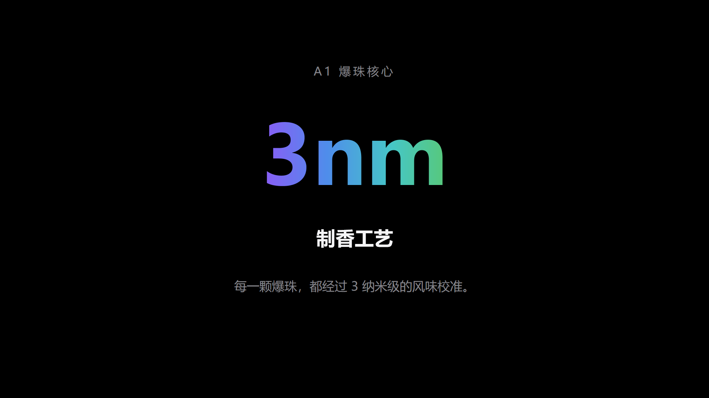

# apple-keynote-ppt

> 苹果发布会风格的 PPT 生成 Skill——把任意主题变成极简、大字、大留白的 Keynote 风演示文稿。

**私有项目 · 未经授权不得分发** | 版本 1.0.0 | 标准 [Agent Skills](https://zhuanlan.zhihu.com/p/2026969192268579241) 格式，兼容 WorkBuddy / ZCode / Claude Code 等 Agent 宿主

---

## 概述

`apple-keynote-ppt` 是一个 AI Agent 技能（Skill）。安装后，对 AI 助手说一句"用苹果发布会风格做一个 XX 的 PPT"，它就会按规范化的六步工作流，产出一套与苹果 Keynote 发布会同等视觉水准的 `.pptx`：

- **纯黑舞台 / 纯白官网**双模式，配合苹果标志性四色渐变标题（紫→蓝→青→绿，XML 级真实渐变）
- **内容与样式分离**：AI 只产出 `outline.json` 大纲，渲染由脚本确定性完成——改文案零成本，风格 100% 一致
- **12 种坐标级版式** + 双道质检（代码级布局检查 + 渲染图视觉验收），杜绝溢出、重叠、乱码

姊妹项目：[ai-apple-video](https://github.com/huangbai-AI/ai-apple-video)（苹果风产品视频），两者共享同一套视觉语言。

## 核心特性

| 特性 | 说明 |
|---|---|
| 双模式色板 | 深色发布会（纯黑 `#000000`）与浅色官网（`#FBFBFD`）两种视觉世界 |
| 四色渐变标题 | `#8B5CF6→#4F8DEB→#46C7C7→#58C878`，通过 OOXML 后处理实现真实渐变文字 |
| 12 种版式 | 封面 / 宣言 / 章节 / 大数字 / 产品主图 / 图文分屏 / 功能点 / 对比 / 阵列 / 引言 / 定价 / 结尾 |
| 确定性渲染 | 色板、字号、留白全部固化为代码，输出风格恒定 |
| 双道 QA | `check_layout.py` 代码级检查（字号/溢出/重叠/变形）+ 渲染 PNG 视觉验收 |
| 纯排版基线 | 无图片输入也成立；用户图片与 AI 配图均有完整规范 |
| 跨宿主兼容 | 标准 Agent Skills 目录结构，WorkBuddy 零修改安装 |

## 效果预览




更多页面见 [`assets/preview/`](assets/preview/)（12 页示例：戏仿"Apple Milk Tea"发布会，深色模式、纯排版）。

## 快速开始

```bash
# 1. 安装到你的 Agent 宿主的 skills 目录（以 WorkBuddy 为例）
cp -r apple-keynote-ppt ~/.workbuddy/skills/

# 2. 安装运行依赖
cd ~/.workbuddy/skills/apple-keynote-ppt/scripts && npm install
pip install python-pptx

# 3. 对 AI 助手说：
#    "用苹果发布会风格做一个 XX 主题的 PPT"
```

详细安装说明（含各宿主路径与故障排查）见 **[docs/INSTALLATION.md](docs/INSTALLATION.md)**。

## 文档导航

| 文档 | 内容 |
|---|---|
| [docs/INSTALLATION.md](docs/INSTALLATION.md) | 环境要求、各宿主安装、依赖、验证、故障排查 |
| [docs/USAGE.md](docs/USAGE.md) | 使用方式、outline.json 字段参考、版式目录、QA 流程、自定义 |
| [docs/COMPATIBILITY.md](docs/COMPATIBILITY.md) | Agent Skills 规范符合性与各宿主（WorkBuddy 等）兼容说明 |
| [CHANGELOG.md](CHANGELOG.md) | 版本更新记录 |
| [SKILL.md](SKILL.md) | AI 读取的核心技能规范（六步工作流 + 速查卡） |

## 项目结构

```
apple-keynote-ppt/
├── SKILL.md                  # AI 技能入口：触发词、六步工作流、速查卡
├── references/               # 按需加载的详细规范（设计语言/版式/叙事/图片）
├── scripts/                  # 主题库、CLI、QA、预览渲染
│   ├── build_deck.js         #   outline.json → .pptx
│   ├── apple_theme.js        #   12 种版式函数 + 色板常量
│   ├── postprocess_gradient.py #   渐变文字 XML 后处理
│   ├── check_layout.py       #   代码级 QA
│   └── render_preview.sh     #   渲染 PNG 预览（PowerPoint/WPS COM）
├── assets/                   # 示例成品与逐页渲染图
└── docs/                     # 产品文档（安装/使用/兼容性）
```

## 环境要求

| 依赖 | 必需 | 用途 | 缺失时 |
|---|---|---|---|
| Node.js ≥ 18 + pptxgenjs | ✅ | 生成 PPTX | `npm install` 一键补齐 |
| Python ≥ 3.10 + python-pptx | ✅ | 代码级 QA、渐变后处理 | 渐变退化为纯色，QA 不可用 |
| Microsoft PowerPoint 或 WPS | 可选 | 渲染 PNG 预览 | 改用 LibreOffice + pdftoppm |

## FAQ

**Q: 生成的 PPT 能自己改吗？**
能。文案全部在 `outline.json` 里，改完重新跑 `node scripts/build_deck.js outline.json deck.pptx` 即可，无需碰任何代码。

**Q: 必须有图片吗？**
不需要。纯排版（大字宣言、超大数字、渐变、色块阵列）是必选基线；有产品图效果更佳，规范见 `references/images.md`。

**Q: 支持英文 PPT 吗？**
支持。字体层自动按文本选择微软雅黑（中文）或 Segoe UI（西文），两种语言混排均可。

**Q: 能在其他电脑上打开吗？**
能。字体使用 Windows 自带的微软雅黑/Segoe UI，在 macOS 上会自动回落到苹方/SF Pro。

## 版权与免责

Copyright © 2026. 保留所有权利。本项目为私有项目，未经作者书面授权，不得复制、分发或公开。

"Apple"、"Keynote" 等字样仅为风格描述与戏仿用途，与 Apple Inc. 无任何关联、授权或代言关系。生成内容不得用于误导消费者、虚假宣传或商业侵权用途。
